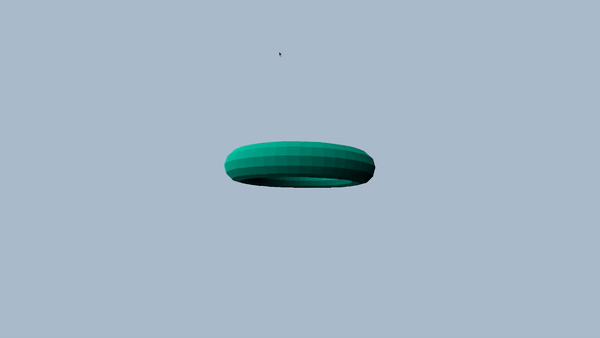

# Simple 3D Renderer

A simple 3D rendering engine based on rasterization. This project demonstrates the fundamentals of 3D rendering, including transformations, projection, z-buffer, textures and shading, implemented from scratch.


## Output Preview



## Getting Started

### Requirements

- A C/C++ compiler (e.g., GCC, Clang)
- [SDL2](https://www.libsdl.org/) library for window management and rendering

### Installation

1. Clone the repository:
   ```bash
   git clone https://github.com/mrmojo2/3drenderer.git
   cd 3drenderer
   ```

2. Build the project:
   ```bash
   make
   ```

3. Run the renderer:
   ```bash
   ./bin/renderer <model.obj>
   ```

   Replace `<model.obj>` with the path to your `.obj` file.

